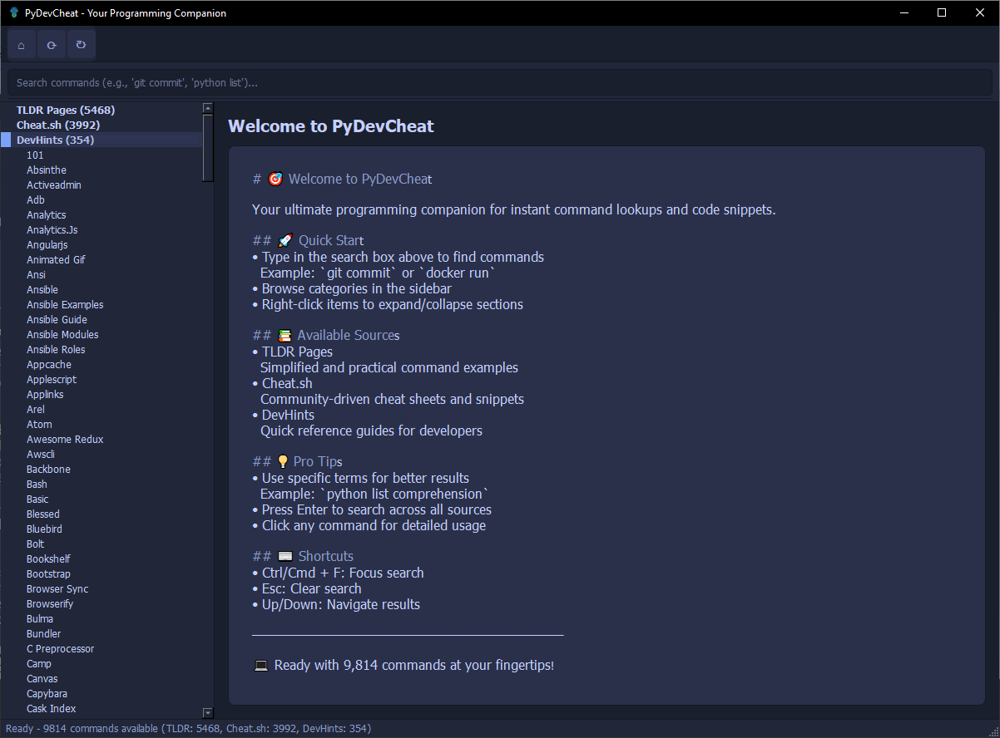

# PyDevCheat

<div align="center">
  
  
  <h1>PyDevCheat</h1>
  
  <p>
    <a href="https://github.com/elirancv/PyDevCheat/actions"></a>
    <a href="https://github.com/elirancv/PyDevCheat/blob/main/LICENSE"></a>
    <a href="https://github.com/elirancv/PyDevCheat"></a>
    <a href="https://github.com/elirancv/PyDevCheat/issues"></a>
    
  </p>

  <h3>Your Ultimate Programming Companion for Instant Command Lookups and Code Snippets</h3>

  <p>
    <a href="#-overview">Overview</a> •
    <a href="#-key-features">Features</a> •
    <a href="#-quick-start">Quick Start</a> •
    <a href="#-installation">Installation</a> •
    <a href="#-usage">Usage</a> •
    <a href="#-development">Development</a>
  </p>
  
  
</div>

## 🌟 Overview

PyDevCheat is a modern, feature-rich development tool that combines the power of multiple cheat sheet sources into one seamless interface. Whether you prefer a sleek GUI or efficient CLI, PyDevCheat provides instant access to programming commands, snippets, and reference guides.

<div align="center">
  <table>
    <tr>
      <td align="center">
        
        <br>
        <b>Modern GUI Interface</b>
      </td>
      <td align="center">
        
        <br>
        <b>Powerful CLI Tool</b>
      </td>
    </tr>
  </table>
</div>

### 📊 Command Coverage

<table>
<tr>
<td align="center" width="25%">
<svg width="48" height="48" viewBox="0 0 512 512" style="display:inline-block;vertical-align:middle">
    <circle cx="256" cy="256" r="240" fill="#1a1f2e"/>
    <path d="M140 160h60v192h-60v-192z" fill="#7aa2f7"/>
    <path d="M220 160h132v40h-132v-192z" fill="#7aa2f7"/>
    <path d="M220 240h100v40h-100v-40z" fill="#7aa2f7"/>
    <path d="M340 160h32v192h-32v-192z" fill="#bb9af7"/>
    <circle cx="300" cy="320" r="12" fill="#bb9af7"/>
</svg>
<br><b>TLDR Pages</b></td>
<td align="center" width="25%">
<svg width="48" height="48" viewBox="0 0 512 512" style="display:inline-block;vertical-align:middle">
    <circle cx="256" cy="256" r="240" fill="#1a1f2e"/>
    <rect x="96" y="136" width="320" height="240" rx="16" fill="#212739"/>
    <path d="M136 196l60 60-60 60" stroke="#7aa2f7" stroke-width="24" stroke-linecap="round" stroke-linejoin="round"/>
    <path d="M216 316h160" stroke="#bb9af7" stroke-width="24" stroke-linecap="round"/>
</svg>
<br><b>Cheat.sh</b></td>
<td align="center" width="25%">
<svg width="48" height="48" viewBox="0 0 512 512" style="display:inline-block;vertical-align:middle">
    <circle cx="256" cy="256" r="240" fill="#1a1f2e"/>
    <path d="M180 140l-80 160 80 160" stroke="#7aa2f7" stroke-width="24" stroke-linecap="round" stroke-linejoin="round"/>
    <path d="M332 140l80 160-80 160" stroke="#7aa2f7" stroke-width="24" stroke-linecap="round" stroke-linejoin="round"/>
    <path d="M280 140l-48 320" stroke="#bb9af7" stroke-width="24" stroke-linecap="round"/>
</svg>
<br><b>DevHints</b></td>
<td align="center" width="25%">
<svg width="48" height="48" viewBox="0 0 512 512" style="display:inline-block;vertical-align:middle">
    <circle cx="256" cy="256" r="240" fill="#1a1f2e"/>
    <rect x="136" y="256" width="240" height="160" rx="8" fill="#212739"/>
    <rect x="156" y="216" width="240" height="160" rx="8" fill="#7aa2f7" fill-opacity="0.8"/>
    <rect x="176" y="176" width="240" height="160" rx="8" fill="#bb9af7" fill-opacity="0.9"/>
    <path d="M256 136v240M176 256h160" stroke="#c4d0ff" stroke-width="24" stroke-linecap="round"/>
</svg>
<br><b>Total</b></td>
</tr>
<tr>
<td align="center"><h3>5,468</h3>commands</td>
<td align="center"><h3>3,992</h3>commands</td>
<td align="center"><h3>354</h3>guides</td>
<td align="center"><h3>9,814</h3>resources</td>
</tr>
<tr>
<td>Simplified command-line examples</td>
<td>Community-driven snippets</td>
<td>Quick reference guides</td>
<td>At your fingertips!</td>
</tr>
</table>

## ✨ Key Features

<div align="center">
  <table>
    <tr>
      <td align="center" width="33%">
        <h3>🎯 Instant Access</h3>
        • Real-time search<br>
        • Smart caching<br>
        • Offline support<br>
        • Multiple sources
      </td>
      <td align="center" width="33%">
        <h3>🎨 Modern Interface</h3>
        • Dark theme<br>
        • Syntax highlighting<br>
        • Tree navigation<br>
        • Keyboard shortcuts
      </td>
      <td align="center" width="33%">
        <h3>⚡ Power Tools</h3>
        • Copy to clipboard<br>
        • Source sync<br>
        • CLI & GUI modes<br>
        • Custom snippets
      </td>
    </tr>
  </table>
</div>

### 🖥️ GUI Experience

<div align="center">
  
</div>

- **Smart Search**
  - Instant filtering across all sources
  - Category-based navigation
  - Real-time results
  - Search history

- **Modern Interface**
  - Dark theme with custom color palette
  - Syntax highlighting for code
  - Tree-based command browser
  - Status bar with live updates

- **Keyboard Shortcuts**
  - `Ctrl/Cmd + F` - Focus search
  - `Esc` - Clear search
  - `Up/Down` - Navigate results
  - `Ctrl/Cmd + C` - Copy content

### 💻 CLI Power

```bash
# Quick command lookup
$ pydevcheat git commit
$ pydevcheat python list

# Source-specific search
$ pydevcheat docker --source cheatsh
$ pydevcheat react --source devhints

# Advanced features
$ pydevcheat sync        # Update sources
$ pydevcheat gui         # Launch GUI
$ pydevcheat --copy     # Copy to clipboard
```

## 🚀 Quick Start

```bash
# Install PyDevCheat
pip install pydevcheat

# Launch GUI
pydevcheat gui

# Or use CLI
pydevcheat git commit
```

## 📦 Installation

### Prerequisites
- Python 3.8 or higher
- pip (Python package manager)
- Git (for development)

### From PyPI
```bash
pip install pydevcheat
```

### From Source
```bash
# Clone repository
git clone https://github.com/elirancv/PyDevCheat.git
cd PyDevCheat

# Install dependencies
pip install -r requirements.txt

# For development
pip install -r requirements-dev.txt
```

## 📖 Usage

### GUI Mode
Launch the graphical interface:
```bash
pydevcheat gui
```

<details>
<summary>🎯 GUI Tips & Tricks</summary>

1. **Efficient Search**
   - Use specific terms: `python list comprehension`
   - Navigate categories in sidebar
   - Press `Enter` to search all sources

2. **Keyboard Navigation**
   - `Tab` between panels
   - `Space` to expand/collapse
   - Arrow keys to navigate

3. **Power Features**
   - Right-click for context menu
   - Double-click to maximize panels
   - Drag to resize sections
</details>

### CLI Mode
```bash
# Basic usage
pydevcheat <command> [options]

# Examples
pydevcheat git commit      # Git commit examples
pydevcheat python dict     # Python dictionary guide
pydevcheat npm --copy     # Copy npm commands
```

<details>
<summary>🛠️ CLI Options</summary>

```bash
Options:
  --source SOURCE  Specify source (tldr|cheatsh|devhints)
  --copy          Copy result to clipboard
  --debug         Enable debug output
  --help          Show this help message
```
</details>

## 🎨 Design

### Color Palette

<div align="center">
  <table>
    <tr>
      <td align="center"><div style="background: #1a1f2e; width: 50px; height: 50px; border-radius: 5px;"></div></td>
      <td align="center"><div style="background: #212739; width: 50px; height: 50px; border-radius: 5px;"></div></td>
      <td align="center"><div style="background: #c4d0ff; width: 50px; height: 50px; border-radius: 5px;"></div></td>
      <td align="center"><div style="background: #7aa2f7; width: 50px; height: 50px; border-radius: 5px;"></div></td>
      <td align="center"><div style="background: #bb9af7; width: 50px; height: 50px; border-radius: 5px;"></div></td>
    </tr>
    <tr>
      <td align="center"><code>#1a1f2e</code><br>Background</td>
      <td align="center"><code>#212739</code><br>Sidebar</td>
      <td align="center"><code>#c4d0ff</code><br>Text</td>
      <td align="center"><code>#7aa2f7</code><br>Primary</td>
      <td align="center"><code>#bb9af7</code><br>Secondary</td>
    </tr>
  </table>
</div>

## 🏗️ Development

### Project Structure
```
PyDevCheat/
├── pydevcheat/           # Main package
│   ├── __init__.py
│   ├── main.py          # CLI implementation
│   ├── gui.py           # GUI implementation
│   └── sources/         # Data sources
│       ├── tldr.py      # TLDR integration
│       ├── cheatsh.py   # Cheat.sh API
│       └── devhints.py  # DevHints parser
├── tests/               # Test suite
├── assets/              # Icons & images
└── docs/               # Documentation
```

### Contributing

1. Fork the repository
2. Create your feature branch
   ```bash
   git checkout -b feature/amazing-feature
   ```
3. Commit your changes
   ```bash
   git commit -m 'Add amazing feature'
   ```
4. Push to the branch
   ```bash
   git push origin feature/amazing-feature
   ```
5. Open a Pull Request

## 📄 License

Distributed under the MIT License. See `LICENSE` for more information.

## 🙏 Acknowledgments

- [TLDR Pages](https://tldr.sh/)
- [Cheat.sh](https://cheat.sh/)
- [DevHints](https://devhints.io/)
- [PyQt6](https://www.riverbankcomputing.com/software/pyqt/)

---

<div align="center">
  Made with ❤️ by <a href="https://github.com/elirancv">Eliran Cohen</a>
  <br><br>
  <a href="https://github.com/elirancv/PyDevCheat/stargazers">⭐ Star us on GitHub</a>
</div> 